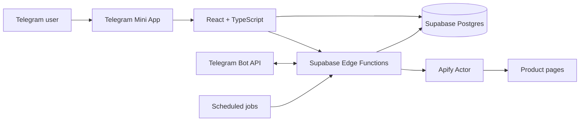

<div align="center">

# 🎁 WishBucket

### Remember every wish. Give the right gift.

A social wishlist and gift-discovery experience built as a Telegram Mini App.
Create shareable wishlists, save products from any store, follow friends, and reserve gifts without spoiling the surprise.

[](https://t.me/wishbucket_bot/app)
[](https://github.com/thatsfov1/wishbucket/stargazers)

[](https://react.dev/)
[](https://www.typescriptlang.org/)
[](https://vitejs.dev/)
[](https://supabase.com/)
[](https://core.telegram.org/bots/webapps)
[](https://apify.com/)
[](https://nodejs.org/)

</div>

---

## About the project

WishBucket brings the entire gift-planning flow into Telegram. Users can create wishlists, paste links from online stores, discover ideas, follow friends, and privately reserve presents—all without installing another app or creating another account.

The project goes beyond a client-only Mini App: it includes a Telegram bot and webhook pipeline, Supabase Edge Functions, a social data model, scheduled birthday notifications, referral-based progression, and a resilient product-metadata scraper backed by Apify.

## What you can do

- **Build flexible wishlists** — create, edit, delete, and share lists with public, private, or link-only visibility.
- **Save products from a URL** — automatically extract a product's title, image, description, price, and currency, with a manual fallback when scraping is unavailable.
- **Plan gifts without spoilers** — browse a friend's public wishes and privately reserve, unreserve, or mark an item as purchased.
- **Grow a social circle** — search for users, follow friends, view their profiles, and explore their wishlists.
- **Never lose a gift idea** — forward a Telegram message to the bot and keep it as a reusable gift hint.
- **Find inspiration** — browse a curated catalog or take a short quiz to narrow down gift ideas.
- **Share native Telegram links** — open referrals, wishlists, and profiles directly through Mini App start parameters.
- **Unlock progression rewards** — earn levels through referrals and unlock additional wishlists and custom covers.
- **Use it in your language** — the Mini App and bot support English, Ukrainian, and Russian.
- **Stay in sync with Telegram** — receive localized gift and birthday notifications from the bot.

## Engineering highlights

- **End-to-end Telegram integration** using the Web Apps SDK, Bot API webhooks, menu configuration, deep links, and forwarded-message handling.
- **Serverless backend** built on Supabase Postgres and six Deno Edge Functions.
- **Multi-stage scraping pipeline** with caching, lightweight metadata extraction, and a Playwright/Crawlee fallback on Apify.
- **Typed frontend architecture** with React, TypeScript, React Router, Zustand, and a dedicated Supabase service layer.
- **Responsive, theme-aware UI** designed for Telegram's mobile viewport while remaining usable in desktop clients.
- **Development-friendly Telegram mock** for running core UI flows in a regular browser.

## Architecture



### Product import flow

1. A user pastes a product URL into a wishlist.
2. The frontend invokes the `scrape-url` Edge Function.
3. Cached metadata is returned when available.
4. Otherwise, an Apify actor extracts structured product data, using Playwright for difficult sites.
5. The user reviews the result before saving it to Supabase.

## Tech stack

| Area | Technology |
| --- | --- |
| Frontend | React 18, TypeScript, Vite 5, React Router |
| State management | Zustand |
| Telegram | `@twa-dev/sdk`, Telegram WebApp API, Telegram Bot API |
| Backend | Supabase Postgres, Supabase Edge Functions (Deno) |
| Data access | `@supabase/supabase-js` |
| Scraping | Apify, Crawlee, Playwright, Metascraper, Impit |
| Local scrape service | Hono on Node.js |
| Localization | Custom EN / UK / RU translation layer |
| Tooling | ESLint, TypeScript compiler, npm, pnpm |

## Repository structure

```text
wishbucket/
├── src/
│   ├── components/          # Reusable UI, modals, navigation
│   ├── config/              # Levels, tasks, and market configuration
│   ├── data/                # Curated gift catalog
│   ├── lib/                 # Supabase client
│   ├── pages/               # Route-level application views
│   ├── services/            # Supabase API and service layer
│   ├── store/               # Zustand application state
│   ├── types/               # App and database types
│   └── utils/               # Telegram, i18n, URL, and affiliate helpers
├── supabase/
│   ├── functions/           # Deno Edge Functions
│   ├── schema.sql           # Core database schema
│   └── hints_schema.sql     # Gift hints schema
├── apify/product-scraper/   # Production scraping actor
├── server/                  # Local Hono scraping service
└── vite.config.ts
```

## Getting started

### Prerequisites

- [Node.js](https://nodejs.org/) `22.22.2` (see `.nvmrc`)
- npm
- A [Supabase](https://supabase.com/) project

### 1. Clone the repository

```bash
git clone https://github.com/thatsfov1/wishbucket.git
cd wishbucket
```

### 2. Install dependencies

```bash
nvm use
npm install
```

### 3. Configure the environment

Create a `.env` file in the project root:

```env
VITE_SUPABASE_URL=https://your-project.supabase.co
VITE_SUPABASE_ANON_KEY=your-anon-key
```

### 4. Start the app

```bash
npm run dev
```

Open [http://localhost:3000](http://localhost:3000). In development, WishBucket provides a mock Telegram user so the main UI can be explored in a normal browser.

> Full Telegram behavior—real user context, bot messages, sharing, and deep links—requires a configured Telegram bot and an HTTPS URL for the Mini App.

## Available commands

| Command | Description |
| --- | --- |
| `npm run dev` | Start the Vite development server on port `3000` |
| `npm run build` | Type-check the project and create a production build |
| `npm run preview` | Preview the production build locally |
| `npm run lint` | Run ESLint with zero warnings allowed |
| `npm run scrape:dev` | Start the local Hono scraper on port `8787` |
| `npm run apify:scraper` | Run the Apify actor locally through pnpm |

## Backend services

The serverless backend lives in `supabase/functions`:

| Function | Responsibility |
| --- | --- |
| `telegram-webhook` | Processes bot commands, language selection, and forwarded gift hints |
| `setup-telegram-bot` | Configures commands, the Mini App menu, and the Telegram webhook |
| `send-telegram-notification` | Sends localized Telegram notifications |
| `scrape-url` | Coordinates cached product extraction through Apify |
| `check-birthdays` | Sends scheduled birthday reminders |
| `resend-hint` | Sends a saved hint back to the user's Telegram chat |

Deploy an Edge Function with the [Supabase CLI](https://supabase.com/docs/guides/cli):

```bash
supabase functions deploy <function-name>
```

Production integrations additionally require Supabase function secrets for the Telegram Bot API and Apify. Secret values are intentionally not committed.

<details>
<summary><strong>Edge Function configuration</strong></summary>

Common secrets include:

```env
SUPABASE_URL=
SUPABASE_SERVICE_ROLE_KEY=
TELEGRAM_BOT_TOKEN=
TELEGRAM_BOT_USERNAME=
WEBAPP_URL=
TELEGRAM_WEBHOOK_URL=
TELEGRAM_WEBHOOK_SECRET_TOKEN=
TELEGRAM_SETUP_SECRET=
APIFY_TOKEN=
APIFY_ACTOR_ID=
```

The functions also support separate `*_MAIN` and `*_DEV` Telegram/Web App values where appropriate.

</details>

## Running the scraper locally

The optional Hono service is useful for developing metadata extraction independently:

```bash
npm run scrape:dev
```

It listens on `http://127.0.0.1:8787` by default. Set `PORT`, `HTTP_PROXY`, `HTTPS_PROXY`, or `IMPIT_IGNORE_TLS_ERRORS` when needed.

To run the production-style Apify actor locally:

```bash
cd apify/product-scraper
corepack pnpm install
APIFY_LOCAL_STORAGE_DIR=./storage corepack pnpm start
```

## Quality checks

```bash
npm run lint
npm run build
```

`npm run build` performs a full TypeScript check before generating the Vite production bundle.

## Project status

The core wishlist, social, reservation, hints, referrals, localization, and product-import flows are implemented. The following experiences are visible as **Coming Soon** and remain on the roadmap:

- Secret Santa group exchanges
- Collaborative gift crowdfunding
- Points marketplace and reward tasks
- Premium subscriptions

## Roadmap

- [ ] Complete Secret Santa draw and participant experience
- [ ] Launch collaborative crowdfunding UI
- [ ] Add automated unit and end-to-end tests
- [ ] Add CI checks for linting and production builds
- [ ] Introduce an in-app notification center
- [ ] Expand the gift recommendation catalog

---

<div align="center">

Built for the place where friends already talk: **Telegram**.

[Try WishBucket](https://t.me/wishbucket_bot/app) · [View source](https://github.com/thatsfov1/wishbucket)

</div>
